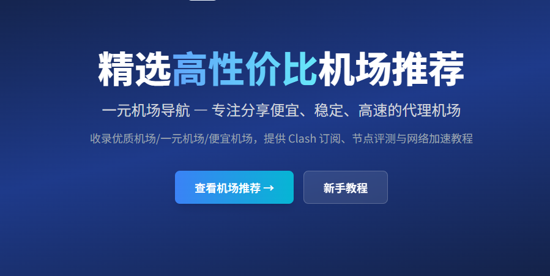
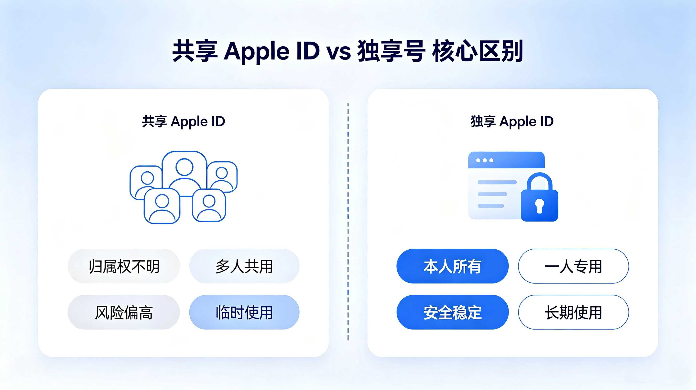
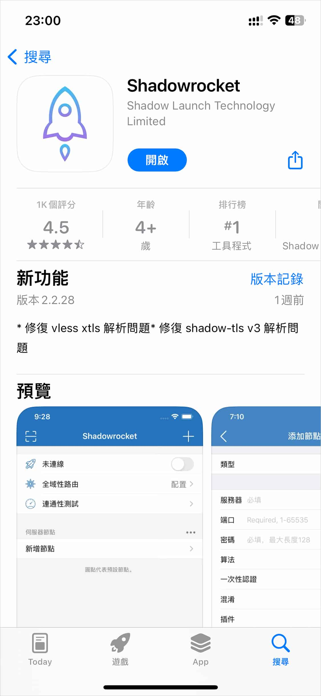
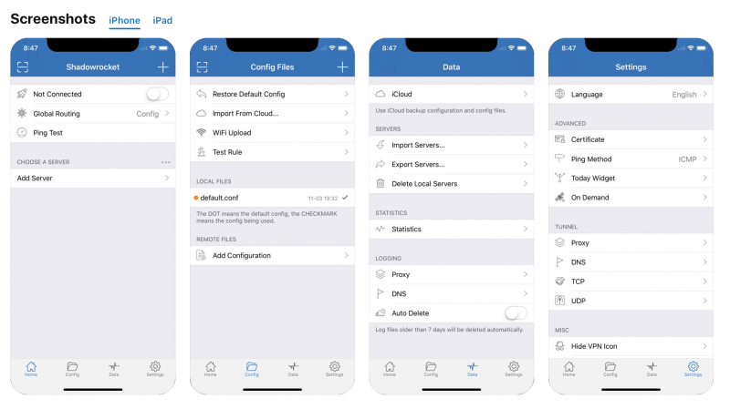

# 小火箭账号 — Shadowrocket 下载、Apple ID 与完整使用指南

*小火箭账号（Shadowrocket）使用指南封面 — 从下载到配置的完整教程，帮助新用户快速上手。*

---

## 目录

- [什么是 Shadowrocket（小火箭）](#什么是-shadowrocket小火箭)
- [如何下载 Shadowrocket](#如何下载-shadowrocket)
- [Apple 美区 ID 是什么](#apple-美区-id-是什么)
- [小火箭共享账号](#小火箭共享账号)
- [小火箭独享账号](#小火箭独享账号)
- [常见问题 FAQ](#常见问题-faq)
- [推荐阅读](#推荐阅读)
- [热门搜索](#热门搜索)

---

## 什么是 Shadowrocket（小火箭）

Shadowrocket，中文常被称为"小火箭"，是一款运行在 iOS 平台上的网络工具客户端。它的图标是一个类似火箭的图形，因此在中文用户圈中被广泛称为小火箭。这款工具的核心功能是帮助用户管理和路由网络流量，通过不同的规则和节点配置来实现灵活的网络访问策略。

### Shadowrocket 的核心用途

Shadowrocket 本质上是一个基于规则的网络流量管理工具。它允许用户导入不同的节点配置，然后根据预设的规则来决定哪些流量走什么路线。这种能力让它在以下场景中非常实用：

- **网络分流管理**：你可以设置国内流量直连、海外流量走代理的规则，这样在访问国内服务时不影响速度，访问海外资源时又能获得稳定的连接。
- **开发与调试**：很多开发者在测试应用时会用到 Shadowrocket 来模拟不同地区的网络环境，检查应用在不同地区的表现。
- **隐私保护**：通过路由规则可以过滤部分追踪器和广告请求，提升浏览体验。

### 为什么需要 Apple ID

这是新用户最常见的困惑。Shadowrocket 只在上架 Apple App Store 提供下载，而它在不同国家和地区的 App Store 中上架情况是不一样的。**中国大陆地区的 App Store 已经下架了 Shadowrocket**，这意味着如果你使用国区 Apple ID，在 App Store 中搜索"Shadowrocket"或"小火箭"是搜不到的。

这就涉及到了[小火箭苹果 ID](https://xiaohuojianid.github.io/)的概念。要下载 Shadowrocket，你需要一个**美区 Apple ID（美国 Apple ID）**或者 Shadowrocket 仍在销售的其它地区的 Apple ID。很多用户因此开始了解和使用海外 Apple ID，这也是为什么小火箭账号和美区 Apple ID 这两个概念经常被一起提及的原因。

### 常见使用场景

Shadowrocket 的使用场景远比想象中丰富。以日常使用来说，有些用户会在手机上同时配置多个节点，根据网络状况自动切换。比如在家用 WiFi 时选择一个节点，出门用 4G/5G 时自动切换到另一个更稳定的节点。Shadowrocket 的分组和策略功能让这种切换变得非常平滑。

从经验来看，新用户最容易遇到的几个问题包括：不知道去哪里下载、下载后不会配置节点、配置了节点但是连不上、或者连接后某些应用打不开。这些问题大部分都与节点配置和规则设置有关，而不是 Shadowrocket 本身的问题。

### 新用户入门路径

如果你是第一次接触 Shadowrocket，建议的入门路线是：先了解什么是小火箭账号，然后准备一个可用的 Apple 美区 ID，接着下载安装 Shadowrocket，最后导入节点并完成基础配置。这个路径看似简单，但每一步都有不少细节需要注意。

*上图展示了 Shadowrocket 的基本工作流程。用户启动应用后，配置好的规则会自动决定流量走向，整个过程对普通用户来说几乎是透明的。这也是 Shadowrocket 受欢迎的原因之一——设置完成后基本不需要再手动操作。*

实际操作中，很多人卡在了第一步——Apple ID。找到可用的[小火箭共享账号](https://xiaohuojianid.github.io/)或者自己注册一个美区 Apple ID，是开始使用 Shadowrocket 的前提条件。如果你不熟悉英文注册流程，使用共享账号是目前最便捷的方式。不过需要注意的是，共享账号和独享账号在使用体验上有明显区别，这一点我们会在后面的章节详细讲解。

另外值得一提的是，Shadowrocket 的规则系统非常灵活。它内置了多种常用规则集，涵盖了主流的中文网站和海外服务。对于大多数用户来说，默认规则已经能满足日常需求。如果你有特殊需求，比如需要调试某个特定应用，也可以自定义规则。这种灵活性是 Shadowrocket 相比同类应用的核心优势之一。

Shadowrocket 对系统资源的占用也控制得相当好。在后台运行时，它的内存占用通常在几十兆左右，对手机的续航影响微乎其微。很多用户反映开了 Shadowrocket 之后几乎感觉不到它在运行，只有当你需要切换节点或者查看流量统计时才会想起它。

---

## 如何下载 Shadowrocket

下载 Shadowrocket 是新用户面临的首要挑战。和普通应用直接在 App Store 搜索下载不同，Shadowrocket 的下载过程涉及一些前置条件，这也是很多教程反复强调的原因。

### 下载前的准备工作

在开始下载之前，你需要确认以下几点已经准备好：

1. **一个可用的美区 Apple ID** — 这是下载 Shadowrocket 的必要条件
2. **iOS 设备（iPhone / iPad）** — Shadowrocket 是 iOS 专属应用
3. **稳定的网络连接** — 下载过程中需要连接到美区 App Store
4. **设备系统版本** — Shadowrocket 最新的版本需要 iOS 12 或更高版本

### 逐步下载流程

整个下载流程并不复杂，但每个环节都有需要注意的地方：

**第一步：在 App Store 中退出当前账号**

打开 App Store，点击右上角的头像图标，向下滑动到底部，点击"退出登录"。这一步很多人会忘记，直接导致后续无法登录美区账号。

**第二步：登录美区 Apple ID**

输入你准备好的美区 Apple ID 和密码进行登录。登录成功后，App Store 会自动切换到美区界面，语言和货币都会变成美元。

**第三步：搜索 Shadowrocket**

在 App Store 搜索框中输入"Shadowrocket"。需要注意的是，不要在美区 App Store 搜索中文名"小火箭"，因为美区的应用名称是英文的。搜索"Shadowrocket"会直接显示结果。

**第四步：下载并安装**

点击获取按钮，可能需要验证 Apple ID（面容 ID 或密码）。下载完成后应用会自动安装到桌面。

### Shadowrocket 下载常见问题

在实际操作中，很多用户会遇到下面这些问题：

**搜不到 Shadowrocket？**

如果在美区 App Store 搜不到 Shadowrocket，最常见的原因是登录的账号并不是美区账号。请确认账号的 App Store 地区确实设置为美国。有些用户虽然注册时选了美国，但后续改过地区，导致无法显示 Shadowrocket。

**下载按钮是灰色的？**

这通常是因为 Apple ID 的账号信息不完整。美区 Apple ID 需要填写美国的地址和支付方式。如果选择"None"作为支付方式，可能因为账单地址不完整导致无法下载。建议填写一个有效的美国地址（免税州地址可以避免消费税）。

**下载后打不开？**

Shadowrocket 需要 iOS 12 及以上版本。如果你的设备系统版本过低，建议先升级系统。另外，越狱设备也可能影响 Shadowrocket 的正常运行。

*上图展示了从 App Store 搜索 Shadowrocket 到完成下载的完整流程。从左到右依次为：登录美区 Apple ID、搜索 Shadowrocket、获取应用、开始下载。每一步都有需要注意的细节，特别是登录环节的账号地区检查。*

### 如何判断下载成功

下载完成后，桌面上会出现一个火箭形状的图标，这就是 Shadowrocket。首次打开应用时，它会请求 VPN 配置权限，这是正常现象。Shadowrocket 需要通过添加 VPN 配置来实现流量管理，点击"允许"即可。

打开后的界面比较简洁，主要分为几个区域：顶部的连接状态开关、中间的节点列表、底部的配置和设置入口。初次打开时节点列表为空，需要手动导入节点或订阅链接。

### Shadowrocket 版本更新

Shadowrocket 的更新频率不算特别高，但每次更新都会修复一些问题或增加新功能。更新的方式和下载类似，需要在美区 App Store 中进行。如果你使用的是[小火箭共享账号](https://xiaohuojianid.github.io/)，更新时需要注意账号是否还能正常登录。有些共享账号因为登录人数过多，可能会被限制更新。

建议定期检查 Shadowrocket 的更新。新版本通常会修复安全漏洞和兼容性问题，保持最新版本可以确保更好的使用体验。如果发现无法更新，可以尝试重新登录 Apple ID 或者切换网络环境后重试。

对于还在使用旧版本的用户，Shadowrocket 的最新版本在界面和功能上都有不少优化。比如新的规则编辑器和更直观的流量统计面板，这些都是老版本没有的。

---

## Apple 美区 ID 是什么

Apple 美区 ID，简单来说，就是地区设置为美国的 Apple ID。每个 Apple ID 都有一个关联的国家或地区设置，这个设置决定了你登录 App Store 后能看到哪些应用、内容定价是什么、以及可以使用哪些服务。小火箭苹果 ID 指的就是专门用于下载 Shadowrocket 的美国 Apple ID。

### 为什么需要美区 Apple ID

Shadowrocket 在中国区 App Store 已经下架多年，这是由多种原因造成的。不仅仅是 Shadowrocket，很多应用在不同地区的上架情况都不一样。对于想要使用 Shadowrocket 的用户来说，拥有一个美区 Apple ID 几乎是必须的。

除了 Shadowrocket 之外，美区 Apple ID 还能下载很多其他国区没有的应用和服务。比如一些海外流媒体应用、特定地区的游戏、以及部分开发工具。这也是为什么很多用户了解了 Apple 美区 ID 之后，会一直保留使用。

### 获取美区 Apple ID 的方式

#### 方式一：自己注册

自己注册美区 Apple ID 是理论上最稳定的方式，但注册流程对不熟悉英文的用户来说有一定门槛。注册时需要注意几个关键点：

- 注册国家/地区必须选择"United States"
- 支付方式可以选择"None"（前提是注册时从 App Store 开始注册，而不是从 Apple ID 官网）
- 账单地址需要填写一个真实的美国地址
- 注册时使用的邮箱不能已经被注册过 Apple ID

自己注册的好处是完全可控，不会因为共享账号被回收而影响使用。但缺点是注册流程相对繁琐，而且苹果对海外 IP 注册有一定的风控措施，有时会要求手机验证。

#### 方式二：使用共享 Apple ID

共享 Apple ID 是目前最流行的方式。顾名思义，就是一个 Apple ID 账号被多个用户共同使用。这种方式的优势在于方便快捷，不需要自己完成复杂的注册流程。但缺点也很明显——多人同时登录容易触发苹果的安全机制，导致账号被锁定或需要验证。

很多用户在初次接触 Shadowrocket 时，都会先尝试[Apple 美区 ID 共享](https://xiaohuojianid.github.io/)的方式。这种方式成本低、见效快，适合只是想先体验一下 Shadowrocket 的新手。

*上图为 Apple ID 管理界面中的地区设置。在"媒体与购买项目"中可以查看当前账号关联的 App Store 地区。如果这里显示为美国，则说明是美区 Apple ID。需要特别注意的是，账号的地区设置不能随意切换，切换后部分已购买的应用可能会受影响。*

### 使用美区 Apple ID 的注意事项

**账号安全是第一位的。** 无论你是自己注册还是使用共享账号，都建议开启双重认证。对于自己注册的账号，绑定手机号可以大幅降低账号被盗的风险。对于共享账号，不要在账号中存储个人数据（如 iCloud 照片、通讯录等），因为所有登录的人都能看到这些信息。

**账号的地区切换需要谨慎。** Apple ID 支持切换 App Store 地区，但切换后原来地区购买的应用可能无法更新。如果你有多个地区的应用需要维护，更建议的做法是准备多个 Apple ID，每个地区一个，在 App Store 中切换登录即可。

**Apple ID 共享的安全性。** 担心共享账号安全是很正常的。一般来说，专门用于应用下载的共享账号风险相对较低，因为这些账号没有绑定支付方式，也没有个人数据。但建议定期修改密码，或者使用提供"独享"服务的账号，避免被过多用户同时使用。

**美区 Apple ID 的使用限制。** 美区 Apple ID 在 iCloud、iMessage 等服务上使用的是美国的服务器，部分功能的体验可能和国区略有不同。比如某些 iCloud 功能在美区可能更早开放。但这些差异对普通用户来说影响不大。

对于还在犹豫要不要使用美区 Apple ID 的用户，一个建议是：可以先通过[美国 Apple ID](https://xiaohuojianid.github.io/)共享账号体验一下 Shadowrocket，确认这个工具确实符合你的需求后，再考虑是否自己注册一个专用的美区账号。这样既不会因为注册流程浪费时间，也能在体验后做出更明智的决定。

---

## 小火箭共享账号

### 什么是共享账号

小火箭共享账号，顾名思义，就是一个 Apple ID 被多个用户共同使用来下载 Shadowrocket。这种模式在中文用户圈中非常普遍，主要是因为自己注册美区 Apple ID 有一定门槛，而共享账号提供了一条捷径。

共享账号的原理很简单：运营方注册好美区 Apple ID（已经购买过 Shadowrocket），然后将账号和密码提供给多个用户使用。用户登录这个账号后，可以在 App Store 的已购项目中找到 Shadowrocket 并免费下载。

### 共享账号适合哪些用户

从实际经验来看，以下几类用户最适合使用共享账号：

**初次尝试 Shadowrocket 的用户**。如果你只是对 Shadowrocket 有点好奇，想先看看它是不是真的有用，那么共享账号成本最低、速度最快。不需要经历从零注册美区 Apple ID 的繁琐流程，几分钟就能完成下载。

**对技术要求不高的用户**。自己注册美区 Apple ID 需要填写英文信息、选择合适的美国地址、还要了解苹果的注册风控规则。对于不熟悉英文或不想折腾的用户来说，共享账号省去了这些麻烦。

**预算有限的用户**。自己注册美区 Apple ID 本身不需要费用，但如果要购买 Shadowrocket（目前售价 $2.99），需要美区 App Store 余额或绑定美区支付方式。共享账号通常以较低的价格提供使用权限，比自己去解决美区支付问题要划算得多。

### 使用共享账号的注意事项

共享账号虽然方便，但在使用过程中有几点需要特别留意：

**登录限制。** 苹果对同一个 Apple ID 同时登录的设备数量有限制。当共享人数过多时，可能会出现登录失败或已被锁定的情况。遇到这种情况，通常等待一段时间后重试即可，或者联系共享服务的运营方更新密码。

**不要登录 iCloud。** 这一点非常重要。共享账号只应该在 App Store 中登录使用，绝对不要登录 iCloud。因为 iCloud 会同步通讯录、照片、备忘录等个人数据，所有能登录这个账号的人都能看到这些数据。要确保只在"媒体与购买项目"中登录共享账号。

**更新问题。** 当 Shadowrocket 发布新版本后，需要使用原来的账号进行更新。如果共享账号的密码已经变更，或者账号已被苹果锁定，可能暂时无法更新。建议发现 Shadowrocket 有新版本时，及时关注共享服务的通知，了解账号状态。

**账号稳定性。** 共享账号的稳定性取决于运营方的维护能力。有些共享服务提供长期稳定的账号，也有部分不够靠谱。在选择时可以参考其他用户的评价。

*上图说明了共享账号的标准使用流程。先用共享账号在 App Store 登录下载 Shadowrocket，下载完成后切换回自己的 Apple ID 使用。Shadowrocket 本身不受 Apple ID 切换的影响，下载后即使退出共享账号也能正常使用。*

### 常见误区

关于[小火箭共享账号](https://xiaohuojianid.github.io/)，有几个常见的认知误区值得澄清：

**误区一：共享账号不安全。** 严格来说，只要是只用于 App Store 下载的共享账号，安全风险是可控的。真正需要注意的是不要在共享账号中启用 iCloud 或存储个人信息。

**误区二：下载后就不能用了。** 实际上，只要你已经在设备上下载了 Shadowrocket，即使之后退出共享账号，应用仍然可以正常使用。只有更新时才需要重新登录共享账号。

**误区三：共享账号随时会失效。** 正规的共享服务会维护多个账号，当一个账号出问题时会有备用方案。选择口碑好的共享服务可以有效降低这种风险。

**误区四：所有共享账号都一样。** 不同的共享服务在账号数量、同时使用人数、密码更新频率等方面差异很大。有的共享服务一个账号可能只有几个人使用，体验和独享相差不大；有的一个账号可能被几十人同时使用，稳定性就差很多。

### 共享账号和独享账号怎么选

这个选择主要取决于你的使用频率和预算。如果你只是偶尔使用，或者还在试用阶段，共享账号性价比更高。如果你已经确定 Shadowrocket 是你每天都会用到的工具，那么[小火箭独享账号](https://xiaohuojianid.github.io/)在稳定性和体验上会更好。我们会在下一章详细讲解独享账号的优势。

---

## 小火箭独享账号

### 什么是独享账号

小火箭独享账号，是指一个 Apple ID 仅供你一个人或极少数人使用的服务形式。与共享账号不同，独享账号的运营方会为你准备一个独立的、没有被大量用户登录过的美区 Apple ID，这个账号只限你一个人使用。

独享账号的核心价值在于**稳定和专属**。你不会因为其他人登录而遇到账号被锁定、密码被改、或者登录人数过多等问题。在体验上，独享账号和使用自己注册的美区 Apple ID 几乎一样。

### 独享账号与共享账号的区别

| 对比维度 | 共享账号 | 独享账号 |
|---------|---------|---------|
| 使用人数 | 多人同时使用 | 单人使用或极少数人 |
| 稳定性 | 受他人使用影响 | 完全独立，不受影响 |
| 更新体验 | 需等待运营方更新密码 | 随时可自行更新 |
| 安全风险 | 需注意不登 iCloud | 几乎无额外风险 |
| 价格 | 较低 | 较高 |
| 适合人群 | 新手、试用用户 | 长期使用者、对稳定性有要求 |

从表格可以清楚看到，独享账号在稳定性和使用体验上有明显优势。特别是对于已经长期使用 Shadowrocket 的用户来说，独享账号省去了很多不必要的麻烦。

### 哪些用户更适合独享账号

如果你是以下类型的用户，独享账号可能更适合你：

**长期稳定使用者**。如果你每天都要用到 Shadowrocket，那么独享账号的稳定性是不可替代的。不需要担心某天打开发现账号被锁定，也不需要被动等待运营方更新密码。

**对账号安全敏感的用户**。即使是共享账号只在 App Store 使用，仍然有人会担心安全问题。独享账号从根本上解决了这个问题——没有其他人知道你的账号密码，账号关联的风险完全可控。

**需要多设备使用的用户**。如果你有 iPhone、iPad 甚至 Apple TV 等多台设备需要安装 Shadowrocket，独享账号可以在所有设备上登录使用，不会因为多设备登录触发安全机制。

**不想频繁操作的用户**。使用共享账号时，每次更新密码后都需要重新登录。独享账号则没有这个烦恼，一次设置好之后，后续几乎不需要额外操作。

### 独享账号的使用建议

拿到独享账号后，建议在首次登录时完成以下几件事：

1. **登录 App Store 下载 Shadowrocket** — 这是最基本的一步
2. **在"已购项目"中找到 Shadowrocket** — 确认购买记录存在
3. **下载后建议开启双重认证** — 如果运营方允许，可以绑定自己的手机号
4. **记录账号信息** — 保存在安全的地方，避免忘记

需要提醒的是，即使是独享账号，运营方也可能保留账号的恢复权限（比如通过注册邮箱重置密码）。所以如果你对安全性有极致要求，还是自己注册美区 Apple ID 最为可靠。

### 独享账号的服务选择

市面上的独享账号服务质量参差不齐，选择时可以参考以下几个标准：

- **账号来源**：是注册的全新账号还是经过处理的二手账号
- **售后服务**：如果账号出现问题是否提供更换
- **是否包含 Shadowrocket 购买**：有的独享账号已经包含 Shadowrocket 的购买记录，到手即用
- **是否支持更换地区**：部分服务支持将账号交给用户自己绑定手机和开启双重认证

选择独享账号服务时，不要只看价格。一个稳定可靠的[小火箭独享账号](https://xiaohuojianid.github.io/)可以省去后续很多麻烦，多花一点钱换来长期稳定的使用体验，对重度用户来说是值得的。

---

## 常见问题 FAQ

### 1. Shadowrocket 为什么搜索不到？

Shadowrocket 在中国大陆的 App Store 已经下架，所以使用国区 Apple ID 搜索不到。需要将 App Store 切换到美区，使用美区 Apple ID 登录后才能搜索到。如果已经切换了美区仍然搜不到，请检查账号的地区设置是否真的是"United States"。

### 2. 小火箭怎么下载？

小火箭需要通过美区 App Store 下载。首先需要一个美区 Apple ID，在 App Store 退出当前账号并登录美区账号，然后搜索"Shadowrocket"即可找到并下载。下载完成后可以切换回国区 Apple ID，不影响应用正常使用。

### 3. Apple 美区 ID 可以长期使用吗？

可以。美区 Apple ID 和其他地区的 Apple ID 一样，可以长期使用。前提是你遵守苹果的使用条款，并且定期登录以避免账号进入休眠状态。自己注册的美区 Apple ID 可以绑定手机号开启双重认证，长期使用完全没有问题。

### 4. 小火箭共享账号安全吗？

从技术角度说，只要遵守使用规范——只在 App Store 中登录、不登录 iCloud、不存储个人数据——共享账号的安全风险是可控的。选择信誉好的共享服务，并注意观察其他用户的反馈，可以进一步降低风险。

### 5. Shadowrocket 更新不了怎么办？

如果无法更新，首先检查登录的是否还是最初下载时使用的 Apple ID。更新时需要登录同一个美区账号。如果账号密码已变更，需要获取新密码后重新登录再更新。如果账号被锁定，需要等待服务方解锁后再尝试。

### 6. 更换 Apple ID 会影响已安装应用吗？

下载 Shadowrocket 之后退出共享账号，应用本身不受影响。这是因为应用下载到设备后，与下载时的 Apple ID 解除绑定。需要注意的是，后续更新时需要重新使用原来的 Apple ID 登录。

### 7. 如何切换 Apple ID？

在 App Store 中点击右上角的头像图标，向下滑动到底部，点击"退出登录"即可退出当前账号。然后输入新的 Apple ID 和密码登录。切换过程不会影响设备上已安装的应用。

### 8. 小火箭独享账号适合哪些人？

独享账号适合长期使用 Shadowrocket 的用户、对稳定性有较高要求的用户、需要在多台设备上同步使用的用户，以及对账号安全比较敏感的用户。相比共享账号，独享账号在稳定性和体验上更有保障。

### 9. Shadowrocket 连接不上怎么办？

连接不上通常有几个可能的原因：节点配置信息有误、节点服务器本身不可用、本地网络环境限制或 Shadowrocket 的规则配置冲突。建议先尝试更换节点，如果还是不行，可以检查订阅是否过期，或者尝试重置规则为默认配置。

### 10. Shadowrocket 支持哪些协议？

Shadowrocket 支持多种主流的代理协议，包括 Shadowsocks、ShadowsocksR、VMess、VLESS、Trojan、Socks5、HTTP 等。这意味着绝大多数节点服务商提供的配置都能在 Shadowrocket 上使用。

### 11. 如何导入节点到 Shadowrocket？

导入节点主要有几种方式：通过订阅链接自动导入、扫描二维码、手动输入配置信息。订阅链接是最方便的方式，在 Shadowrocket 中点击右上角的"+"号，选择"类型"为"Subscribe"，填入订阅地址即可。节点信息会自动更新。

### 12. Shadowrocket 耗电吗？

Shadowrocket 对电量的影响在同类应用中属于较低水平。在后台运行时，它主要通过 VPN 接口处理流量转发，现代 iOS 设备对这种轻量级后台任务的电量消耗控制得很好。如果发现耗电异常，可以检查是否是某个节点的网络质量差导致频繁重连。

### 13. 为什么 Shadowrocket 需要添加 VPN 配置？

Shadowrocket 需要通过系统 VPN 框架来实现流量管理。添加 VPN 配置后，系统会将指定流量转发给 Shadowrocket 处理。这是 iOS 系统支持的网络管理方式，所有同类工具都需要这个权限。Shadowrocket 不会记录你的网络活动数据。

### 14. 一个 Apple ID 可以在几台设备上登录？

苹果允许一个 Apple ID 在多台设备上登录 App Store，但没有明确的固定数量限制。不过同时登录的设备过多可能会触发安全验证。一般来说，5 台以内是比较安全的范围。共享账号的使用人数对稳定性有很大影响。

### 15. Shadowrocket 的规则怎么设置？

Shadowrocket 的规则包括域名匹配、IP 匹配、端口匹配等多种类型。默认规则集已经覆盖了大部分常见场景。如果需要自定义规则，可以在"配置"菜单中编辑。对于普通用户来说，默认配置加上去广告规则就足够了。

### 16. 美区 Apple ID 需要填写真实地址吗？

注册美区 Apple ID 时需要填写美国地址，但这个地址不一定需要是你真实的居住地址。重要的是地址格式正确、邮编有效。建议使用免税州（如俄勒冈州、阿拉斯加州）的地址，可以避免消费税费。

### 17. 海外 Apple ID 和国区 Apple ID 有什么区别？

主要区别在于 App Store 可用的应用和内容不同。海外 Apple ID 可以下载国区没有的应用，比如 Shadowrocket、部分流媒体应用等。其他如 iCloud 存储、App 内购买等功能基本一致。部分地区 Apple ID 在隐私政策和服务条款上略有差异。

### 18. 小火箭账号购买后不到账怎么办？

如果购买后没有收到账号信息，建议先检查购买时填写的联系方式是否正确。如果信息无误，可以联系卖家客服处理。正规的小火箭账号服务都有售后保障，遇到问题及时沟通通常都能解决。

### 19. Shadowrocket 配置会丢失吗？

一般情况下，只要不卸载应用，配置不会丢失。但如果重装应用或者更换设备，需要重新导入配置。建议在设置中开启 iCloud 同步功能，这样配置信息会在登录同一个 iCloud 账户的设备间同步。

### 20. iPad 上可以使用 Shadowrocket 吗？

可以。Shadowrocket 是通用应用，支持 iPhone 和 iPad。在 iPad 上的使用体验和 iPhone 基本一致，页面会根据屏幕尺寸自适应显示。在 iPad 上使用 Shadowrocket 时，建议横屏使用，界面布局更合理。

### 21. Shadowrocket 能用于游戏加速吗？

Shadowrocket 本身是一个网络流量管理工具，可以通过配置合适的节点来改善游戏连接。效果取决于节点的网络质量。对延迟敏感的游戏，建议选择延迟较低的节点。需要注意的是，部分游戏对 VPN 类工具有一定的检测机制。

### 22. Apple ID 被锁定了怎么解锁？

Apple ID 被锁定通常是因为多次输入错误密码或被系统检测到异常登录。解锁方法：访问 appleid.apple.com，点击"解锁账号"，按照提示完成验证。如果是因为共享账号被锁定，需要联系账号的维护方来处理。

### 23. Shadowrocket 有没有 Android 版？

Shadowrocket 是 iOS 专属应用，没有 Android 版本。Android 用户需要使用其他类似的工具。不过 Shadowrocket 的开发和更新主要针对 iOS 平台，在 iOS 上的体验是最好的。

### 24. 美区 Apple ID 的密码有要求吗？

美区 Apple ID 的密码要求和国区基本一致：至少 8 个字符，包含大小写字母和数字。建议使用高强度的密码，避免使用与其他网站相同的密码。如果使用共享账号，运营方通常会定期更新密码以保障账号安全。

### 25. 如何查看 Shadowrocket 的流量使用情况？

Shadowrocket 内置了流量统计功能。在主界面上滑可以看到当前会话的流量使用情况，包括上传和下载数据量。也可以在设置中查看更详细的统计信息，按日、周或月查看流量消耗。

*上图为 Shadowrocket 常见问题的解决方案概览。从下载到配置，从账号到节点，每个环节都可能遇到问题。遇到困难时，建议先从最常见的问题入手排查，大多数问题都有成熟的解决方案。*

### 26. Shadowrocket 订阅链接在哪里获取？

订阅链接通常由节点服务商提供。购买节点服务后，服务商的管理后台会有订阅地址。在 Shadowrocket 中添加订阅链接后，应用会自动拉取节点列表。如果订阅链接失效，需要联系服务商更新。

### 27. 更换 iPhone 后如何迁移 Shadowrocket？

换新手机后，只需要在旧手机上退出 Apple ID 登录，新手机登录同一个美区 Apple ID 后在已购项目中重新下载即可。配置信息如果开启了 iCloud 同步，会自动同步到新设备上。建议在换机前确认 iCloud 同步已开启。

### 28. Shadowrocket 的配置文件可以导出吗？

可以。在 Shadowrocket 的设置页面中，可以选择导出配置文件。导出的文件可以保存到本地或发送到其他设备，方便多台设备使用相同的配置。如果更换设备，导入之前导出的配置文件即可恢复设置。

---

## 推荐阅读

以下文章可以帮助你更全面地了解 Shadowrocket 和小火箭账号的相关知识：

- [Shadowrocket 下载教程](https://xiaohuojianid.github.io/) — 从零开始的详细下载指南，适合首次接触的新手
- [小火箭共享账号](https://xiaohuojianid.github.io/) — 深入了解共享账号的使用方法和注意事项
- [小火箭独享账号](https://xiaohuojianid.github.io/) — 为什么独享账号更适合长期用户
- [Apple 美区 ID](https://xiaohuojianid.github.io/) — 如何注册和使用美区 Apple ID
- [小火箭苹果 ID](https://xiaohuojianid.github.io/) — 苹果 ID 与小火箭的完整关联解析
- [Shadowrocket 使用教程](https://xiaohuojianid.github.io/) — 从配置到优化，覆盖日常使用全场景
- [Shadowrocket 节点配置指南](https://xiaohuojianid.github.io/) — 节点导入、分组、策略设置详解
- [Apple 美区 ID 共享](https://xiaohuojianid.github.io/) — 共享 Apple ID 的优缺点分析
- [美国 Apple ID 注册教程](https://xiaohuojianid.github.io/) — 手把手教你注册自己的美区账号
- [Shadowrocket 常见问题汇总](https://xiaohuojianid.github.io/) — 使用时遇到问题先来这里找答案

> 💡 **小技巧**：阅读完基础教程后，建议按照自己的使用习惯定制规则配置。Shadowrocket 的规则系统非常灵活，花十分钟调整规则可以大幅提升使用体验。

---

## 热门搜索

很多用户在搜索小火箭账号之后，还会继续了解 Apple 美区 ID、小火箭共享账号、Shadowrocket 下载、小火箭苹果 ID、Shadowrocket 更新等相关内容。这些搜索词背后反映的是用户从了解到使用 Shadowrocket 的完整路径。

Shadowrocket 下载是用户最关注的环节。对于刚接触的朋友来说，最想知道的就是小火箭怎么下、去哪里下、下了之后怎么用。这也解释了为什么 Shadowrocket 下载教程一直是用户搜索频率最高的内容。下载之后紧接着就是 Apple 美区 ID 的问题——为什么需要美区账号、没有美区账号怎么办、共享账号和独享账号有什么区别。这些问题环环相扣，构成了用户探索 Shadowrocket 的完整链条。

从搜索行为来看，用户在初次接触时通常会先搜索 Shadowrocket 的基础信息，了解它是什么、能做什么。确认需求后，下一步就是寻找下载渠道。这时候小火箭共享账号、Apple 美区 ID 这些关键词的搜索量会明显上升。下载完成后，用户的关注点会转向使用层面——怎么导入节点、怎么配置规则、怎么切换节点等。这些阶段性的搜索习惯，反映了用户从了解到使用再到熟练的自然进程。

在实际的搜索词中，Shadowrocket 教程这个关键词很有意思。它包含了从基础到进阶的各种内容需求。有的用户需要的是最基本的安装教程，有的需要的是规则配置教程，还有的需要的是故障排查教程。在写教程类内容时，覆盖不同深度的用户需求是很有必要的。

Apple 美区 ID 的搜索通常伴随着两个方向：一个是"怎么自己注册"，另一个是"有没有现成的可以用"。这两种需求在用户群中基本各占一半。选择自己注册的用户通常对账号安全性和长期稳定性有更高要求；选择现成账号的用户则更看重效率和便利性。这也解释了为什么市场上既有美区 ID 注册教程，也有共享账号和独享账号服务。

小火箭苹果 ID 这个搜索词特别有意思。它把 Apple ID 和小火箭这两个概念绑定在了一起，间接说明了在用户认知中，Apple ID 和 Shadowrocket 下载是分不开的。这其实是一个很好的信号——说明用户正确理解了下载 Shadowrocket 需要美区 Apple ID 这个前提条件。

海外 Apple ID 的搜索用户往往有着更广泛的需求。除了下载 Shadowrocket，他们可能还想体验其他仅在海外市场提供的应用和服务。这部分用户的探索意愿更强，也更愿意花时间去了解账号注册和维护的相关知识。

从用户地域来看，搜索这些关键词的用户涵盖了各个年龄层和职业背景。有学生、有上班族、有技术人员、也有纯粹的网络爱好者。这种广泛的用户基础也说明 Shadowrocket 的使用场景非常多样化。

搜索数据还显示，Shadowrocket 的搜索量在晚上和周末有明显的上升趋势。这符合工具的属性——用户在工作日使用场景较少，休息日有更多时间去探索和配置。这也提醒我们，在周末发布新教程或更新内容，会获得更好的传播效果。

总的来看，Shadowrocket 相关的搜索生态非常丰富。从基础概念到下载安装，从账号准备到节点配置，每个环节都有对应的搜索需求。对于第一次接触的用户来说，按照"了解→下载→配置→使用"这个路径来获取信息是最高效的。

---

### 总结与导航

Shadowrocket（小火箭）作为 iOS 平台上最受欢迎的网络工具之一，其下载和使用涉及多个环节。从了解什么是小火箭、到准备美区 Apple ID、再到下载安装和节点配置，每个步骤都有需要注意的细节。

对于初次接触的用户，推荐的入门路径是：先阅读本文的"什么是 Shadowrocket"章节了解基础概念，然后根据自身情况选择共享账号或独享账号来下载应用。下载完成后，参考本文的 FAQ 部分解决使用中遇到的问题。如果还想深入了解规则配置和优化技巧，"推荐阅读"部分的文章可以提供更详细的信息。

本站定位为纯粹的知识分享平台，所有内容均为 Shadowrocket 相关教程和使用经验分享。我们坚持合规运营，不涉及任何破解、绕过限制或非法用途。所有文章旨在帮助用户更好地了解和使用这款工具，解决在下载、安装和配置过程中遇到的实际问题。

小火箭账号的核心在于 Apple ID。无论是自己注册美区 Apple ID，还是使用共享账号或独享账号服务，选择一个稳定可靠的方式是关键。对于短期试用，共享账号性价比高；对于长期使用，独享账号或自注册账号在稳定性和安全性上更有保障。

使用 Shadowrocket 的过程中，遇到问题是正常的。大部分问题都有成熟的解决方案，在 FAQ 章节中我们已经整理了最常遇到的 28 个问题及其解决方法。如果阅读本文后仍有疑问，可以通过站内[小火箭苹果 ID](https://xiaohuojianid.github.io/)相关文章获取更详细的解答，或参考[Shadowrocket 使用教程](https://xiaohuojianid.github.io/)获取进阶配置指导。

最后，我们欢迎所有对 Shadowrocket 感兴趣的用户在本站学习交流。无论你是刚接触的新手，还是已经熟练使用的老用户，希望这里的[小火箭共享账号](https://xiaohuojianid.github.io/)指南、[小火箭独享账号](https://xiaohuojianid.github.io/)解析、[Apple 美区 ID](https://xiaohuojianid.github.io/)教程等内容，能够帮助你更顺畅地使用 Shadowrocket。在后续的更新中，我们还会继续补充更多实用的教程和技巧，敬请关注。

> **法律声明**：本站所有内容仅供知识学习和参考。请遵守当地法律法规，在合规范围内使用相关工具和服务。使用者应自行承担使用过程中的相关责任。

---

*© 小火箭账号 | 本站内容定期更新，建议收藏以便获取最新教程和指南。*

[⬆ 返回顶部](#小火箭账号--shadowrocket-下载apple-id-与完整使用指南)
